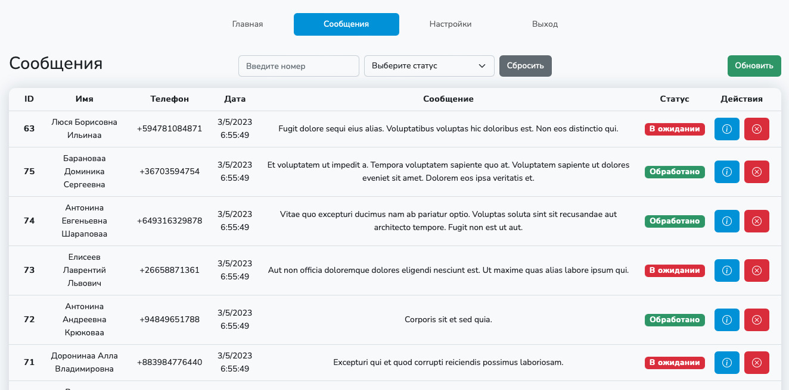

# Laravel Sanctum


# Использованные технологии
Laravel 8, Laravel Sanctum, Laravel Sail, Laravel Mix, Laravel UI, Vue.js (3), VUEX (4)

# Используемые языки
PHP, JavaScript, SQL, HTML + SCSS

# Возможности приложения
1. Форма обратной связи, все поля проходят валидацию (валидация на стороне сервера):
    - телефон (только российские мобильные номера),
    - ФИО (минимум 3 максимум 255 символов),
    - текст сообщения (минимум 3 максимум 255 символов)

   Записи из формы сохраняются в БД MySQL с меткой времени

2. API с авторизацией Sanctum:
    - получение всех записей
    - получение только обработанных или только не обработанных записей
    - получение записей с фильтрацией по номеру телефона (пол любому количеству цифр, цифры могут быть любой частью номера телефона)
    - редактирование, все поля проходят валидацию как и форма из пункта 1
    - пометка записи обработанной

3. Создание новых пользователей при помощи artisan команды "php artisan user:create login password"

# Установка и запуск
Склонируйте репозиторий  https://github.com/olegopro/laravel-sanctum. Для этого откройте терминал, перейдите в папку где проектами и введите следующую команду для клонирования репозитория на локальный компьютер:
```bash
git clone https://github.com/olegopro/laravel-sanctum
```
После этого перейдите в папку с проектом:
```bash
cd laravel-sanctum
```

Установите зависимости composer следующей командой:
```bash
composer update
```

Сконфигурируйте приложение laravel следующей командой:
```bash
cp .env.example .env
```

Запустите Laravel Sail (Docker):
```bash
./vendor/bin/sail up
```

Дождитесь запуска контейнера. Откройте новую вкладку в терминале, перейдите в корень проекта и выполните следующие команды.

Установите javascript пакеты:
```bash
./vendor/bin/sail yarn
```
Сгенерируйте app key следующей командой:
```bash
./vendor/bin/sail php artisan key:generate
```

Откройте файл .env и отредактируйте поле DB_HOST:
```
DB_HOST=mysql
```

Запустите миграцию, ключ --seed можно опустить:
```bash
./vendor/bin/sail php artisan migrate:fresh --seed
```
Ключ --seed нужен для запуска фабрики, которая заполнит таблицу messages фейковыми данными.

Все! Сервер доступен по адресу http://localhost
